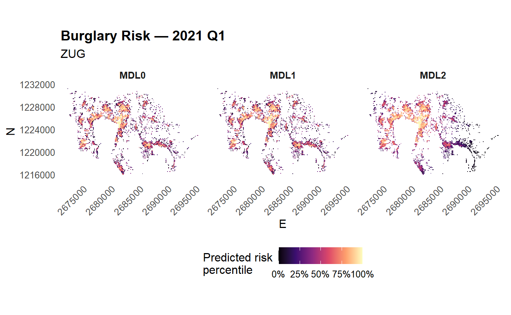
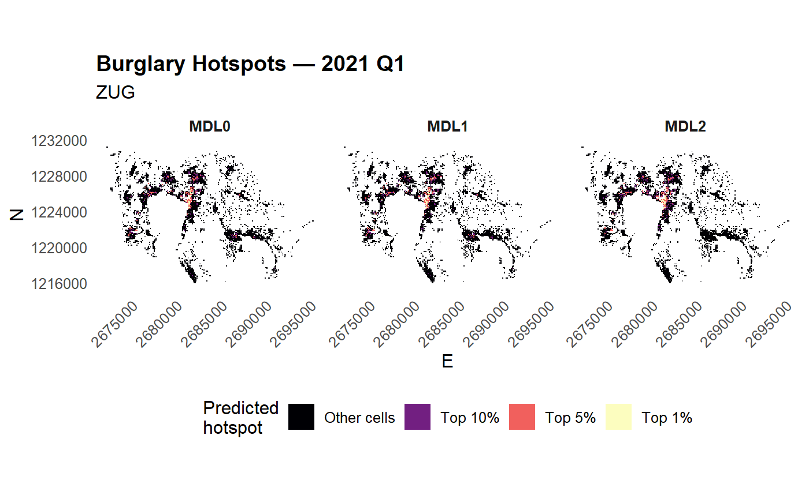
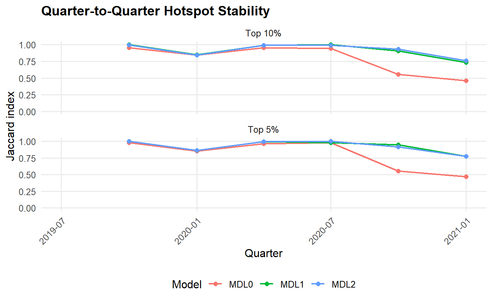
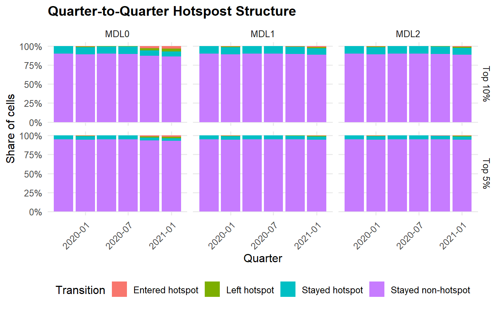
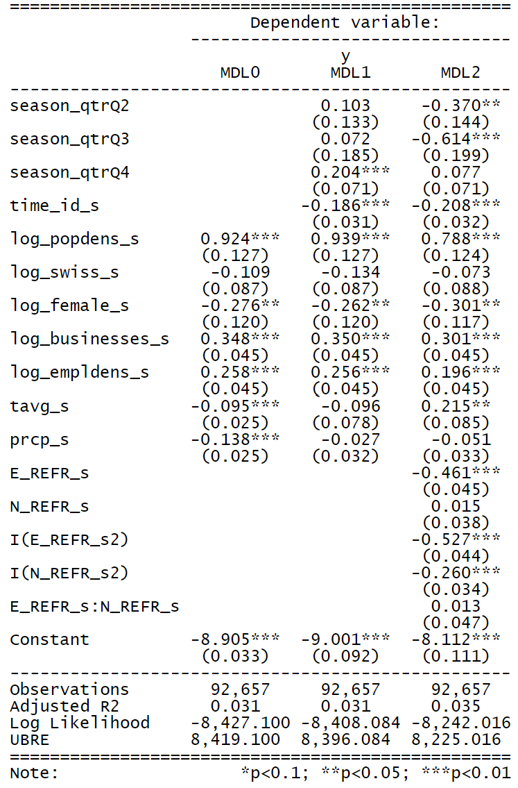

# Quarterly Burglary Prediction in Zug
---
###
This repository contains the code used to model and predict quarterly burglary counts across spatial grid cells in the Swiss cantons of Zug. The project reformulates burglary forecasting from a sparse daily classification problem, with a very high imbalance ratio, into a quarterly spatial count prediction problem. The objective is to identify spatial areas that consistently exhibit elevated quarterly risk and may therefore deserve greater preventive attention from police officers and patrolling activities.
---
## Research question

The main research question is:

> Does explicitly modelling overdispersion, nonlinear spatial patterns, and temporal (seasonal) persistence improve quarterly burglary hotspot identification in low-crime-density regions?

The analysis compares three increasingly flexible count models:

1. a Poisson Regression (benchmark);
2. a Poisson Regression with temporal (seasonal) fixed effects;
3. a Poisson Regression with spatio-temporal fixed effects.

The models are evaluated using:

- AIC and BIC;
- out-of-sample MAE;
- crime capture rates;
- the Prediction Accuracy Index (PAI);
- quarter-to-quarter hotspot stability.

---

## Data structure

The original dataset contains daily observations for spatial RELI grid cells.
The daily observations are aggregated by RELI cell and calendar quarter:

```math
Y_{it}
=
\sum_{d \in t}
\mathrm{Burglary}_{id}
```

where:

- $i$ identifies a spatial RELI cell;
- $t$ identifies a calendar quarter;
- $Y_{it}$ is the number of recorded burglaries in cell $iä during quarter $t$.

The quarterly dataset contains:

- burglary counts;
- spatial coordinates;
- population density;
- employment and business density;
- temperature and precipitation;
- calendar variables.

The number of observed days in each RELI-quarter is included as an exposure term (offset of the Poisson regression).
---

## Quarterly aggregation

The main aggregation procedure is:

```r
df_q <- df %>%
  mutate( date = as.Date(date),
          quarter = lubridate::floor_date(date, unit = "quarter")
  ) %>%
  group_by(RELI, quarter) %>%
  summarise(
    y = sum(flag, na.rm = TRUE),

    E_REFR = first(E_REFR),
    N_REFR = first(N_REFR),

    popdens      = mean(popdens, na.rm = TRUE),
    swiss_pop    = mean(swiss_pop, na.rm = TRUE),
    nonswiss_pop = mean(nonswiss_pop, na.rm = TRUE),
    male_pop     = mean(male_pop, na.rm = TRUE),
    female_pop   = mean(female_pop, na.rm = TRUE),

    businesses   = mean(businesses, na.rm = TRUE),
    empldens     = mean(empldens, na.rm = TRUE),

    tavg = mean(tavg, na.rm = TRUE),
    prcp = sum(prcp, na.rm = TRUE),

    n_days = n_distinct(date),
    .groups = "drop"

  ) %>%
  mutate( year = lubridate::year(quarter),
          qtr = lubridate::quarter(quarter),
          time_id = match(quarter, sort(unique(quarter)))
)
```

---

## Model specifications

All three models use a Poisson likelihood for quarterly burglary counts and the same demographic, structural, and weather covariates.

For RELI cell $i$ in quarter $t$,

```math
Y_{it}\mid X_{it}\sim Poisson(\mu_{it}),
```

with log link

```math
\log(\mu_{it}) = \eta_{it} + \log(n_{it}),
```

where $n_{it}$ is the number of observed days in the RELI-quarter. The term $\log(n_{it})$ is included as an offset, so the models account for differences in exposure.

The common covariates are:

- population density;
- Swiss population;
- female population;
- number of businesses;
- employment density;
- average temperature;
- cumulative precipitation.


---

### MDL0: Non-spatial and non-temporal Poisson benchmark

Quarterly burglary counts are modelled using only demographic, structural, and weather covariates:

```math
\log(\mu_{it})
=
\beta_0
+
X_{it}'\boldsymbol{\beta}
+
\log(n_{it}).
```

---

### MDL1: Poisson model with seasonal and linear temporal effects

MDL1 extends the benchmark by adding:

- quarter-of-year seasonal fixed effects;
- a linear time trend.

The model is

```math
\log(\mu_{it})
=
\beta_0
+
\delta_{q(t)}
+
\beta_t t
+
X_{it}'\boldsymbol{\beta}
+
\log(n_{it}).
```

where:

- $\delta_{q(t)}$ captures differences between Q1, Q2, Q3, and Q4;
- $\beta_t t$ captures an increase or decrease in burglary risk over the sample period.

---

### MDL2: Poisson model with temporal effects and a quadratic spatial trend

MDL2 adds a deterministic spatial component to MDL1 using the standardized geographic coordinates of each RELI cell.

The model is

```math
\log(\mu_{it})
=
\beta_0
+
\delta_{q(t)}
+
\beta_t t
+
X_{it}'\boldsymbol{\beta}
+
s_{\mathrm{quad}}(E_i,N_i)
+
\log(n_{it}).
```

where

```math
s_{\mathrm{quad}}(E_i,N_i)
=
\gamma_1E_i
+
\gamma_2N_i
+
\gamma_3E_i^2
+
\gamma_4N_i^2
+
\gamma_5E_iN_i.
```

The linear coordinate terms allow risk to vary from east to west and from north to south. The squared and interaction terms allow the spatial surface to bend and capture broad geographic patterns.

This model can represent:

1. increasing risk toward one side of the study area;
2. higher or lower risk around a central region;
3. different spatial gradients across the canton.

---

## Model hierarchy

| Model | Temporal effects | Spatial effects |
|---|---|---|
| MDL0 | None explicitly modelled | None explicitly modelled |
| MDL1 | Quarter fixed effects and linear time trend | None |
| MDL2 | Quarter fixed effects and linear time trend | Quadratic function of coordinates |

## Train-test design

The models are evaluated using a chronological split:

- the first 80% of quarters are used for training;
- the final 20% of quarters are used for testing.

---

## Main results

| Model | AIC | BIC | MAE | RMSE | Capture at 5% | PAI at 5% | Jaccard at 5% | Capture at 10% | PAI at 10% | Jaccard at 10% |
|---|---:|---:|---:|---:|---:|---:|---:|---:|---:|---:|
| MDL0 | 16854.20 | 16929.69 | 0.0238 | 0.1183 | 32.17% | 6.42 | 0.800 | 47.20% | 4.71 | 0.786 |
| MDL1 | 16816.17 | 16929.41 | 0.0217 | 0.1181 | 32.87% | 6.56 | 0.926 | 46.85% | 4.68 | 0.913 |
| MDL2 | **16484.03** | **16644.45** | **0.0215** | 0.1183 | **34.62%** | **6.91** | 0.925 | 46.15% | 4.61 | **0.919** |

### Main findings

MDL2 provides the strongest overall statistical fit, with lower AIC and BIC values than the other specifications. Its main operational advantage emerges under some sort of resource constraints: (i) prioritizing only the top 5% of RELI cells captures approximately 34.6% of observed burglaries; (ii) the corresponding PAI is 6.91; (iii) the selected hotspot cells are highly stable across consecutive quarters (Jaccard at 5% is fairly high for MDL2 and MDL1).

At the broader 10% threshold, the three models have similar capture rates. The Poisson benchmark achieves a small numerical advantage in crime capture, while MDL1 and MDL2 generate substantially more stable hotspot sets.

---

## Prediction Accuracy Index

The Prediction Accuracy Index evaluates how concentrated crimes are within the predicted hotspot area.

For a selected share $k$ of spatial cells:

```math
\mathrm{PAI}_{k}
=
\frac{\text{crime capture rate at }k}
{\text{share of cells selected}}.
```

For example, MDL2 obtains:

```math
\mathrm{PAI}_{5\%}=6.91.
```

This means that the selected top 5% of cells contain burglaries at approximately 6.9 times the concentration expected under a uniform spatial allocation.

---

## Jaccard hotspot stability

The Jaccard index measures the overlap between hotspot sets in consecutive quarters:

```math
J_t
=
\frac{|H_t \cap H_{t-1}|}
{|H_t \cup H_{t-1}|}.
```

where $H_t$ is the predicted hotspot set in quarter $t$.

Interpretation:

- $J=0$: no overlap;
- $J=1$: identical hotspot sets.

A high value therefore indicates stable priority areas.

Interestingly, MDL1 and MDL2 produce average Jaccard values above 0.91, compared with approximately 0.79–0.80 for the benchmark.

This indicates that the richer temporal and spatial specifications identify a persistent core of high-risk areas that does not change substantially from one quarter to the next.

---

## Figures

### Quarterly relative-risk maps

The relative-risk percentile shows where each cell lies in the predicted risk ranking for the same model and quarter. A percentile of 0.95 means that the cell has a higher predicted count than approximately 95% of the other cells. It is, therefore, a relative ranking and should a 95% probability of burglary.



---

### Quarterly hotspot maps

The hotspot map is a categorical version of the relative-risk map, also potentially useful for policy. Cells are classified into groups such as:

- other cells;
- top 10%;
- top 5%;
- top 1%.

This visualization is more directly connected to resource prioritization.



---

### Jaccard stability over time

The following figure reports the overlap between hotspot sets in consecutive quarters.



---

### Hotspot transitions

Cells are classified according to their transition between consecutive quarters:

- stayed hotspot;
- entered hotspot;
- left hotspot;
- stayed outside the hotspot set.



---

### Model summaries



---

## Interpretation for policy

Our proposed model (MDL2) is able to identify areas with relatively elevated expected quarterly counts. The results suggest two possible planning scenarios.

### Highly constrained resources

When preventive attention can cover only 5% of cells, MDL2 provides the strongest concentration of observed burglary events.

### Broader preventive coverage

When 10% of cells can be covered, the models have similar capture performance. In this case, the greater stability of MDL1 and MDL2 may be more useful than small differences in crime capture.

Persistent hotspots may be relevant for:

- preventive patrol planning;
- environmental security assessments;
- coordination with local authorities;
- evaluation of persistent structural vulnerabilities.

---

## Repository structure

```text
.
├── README.md
├── R
│   ├── 01_data_aggregation.R
│   ├── 02_covariate_creation.R
│   ├── 03_model_estimation.R
│   ├── 04_model_evaluation.R
│   ├── 05_hotspot_metrics.R
│   └── 06_figures.R
│
├── figures
│   ├── quarterly_relative_risk.png
│   ├── quarterly_hotspots.png
│   ├── jaccard_over_time.png
│   ├── hotspot_transitions.png
│   └── model_comparison.png
│
├── output
│   ├── model_comparison.csv
│   ├── quarterly_predictions.csv
│   └── hotspot_metrics.csv
│
└── poster
│   └── EMS_2026.tex
│
└── paper
    └── AGILE_2026.tex
```

---

## Required R packages

The main packages are:

```r
required_packages <- c(
  "dplyr",
  "tidyr",
  "purrr",
  "lubridate",
  "ggplot2",
  "scales",
  "MASS",
  "mgcv",
  "spdep",
  "stargazer",
  "knitr"
)

install.packages(
  setdiff(
    required_packages,
    rownames(installed.packages())
  )
)
```

Load the packages with:

```r
library(dplyr)
library(tidyr)
library(purrr)
library(lubridate)
library(ggplot2)
library(scales)
library(MASS)
library(mgcv)
library(spdep)
library(stargazer)
library(knitr)
```

---

## Reproducing the analysis

TODO: data


---

## Limitations

---

## Authors
- Luca Persia
- Eduardas Lazebnyj

## Project Lead
- Andrea Günster

## Contributors
- Damian Kozbur
- Jérémy Decerle
- Nicole Bellert
- Felix (TODO: add Felix surname)

---

## Related project

This work is part of the research project:
**Quantifying Illegal Activity: Estimating Dark Rates and Predicting Offenses**
TODO: add previous working paper

---

## Citation

TODO: A citation entry will be added after publication.

```

---

## License

Code is released for academic and research purposes. Data are not directly available as they have been provided by LogObject AG and through an Innosuisse Grant "Quantifying Illegal Activity".
